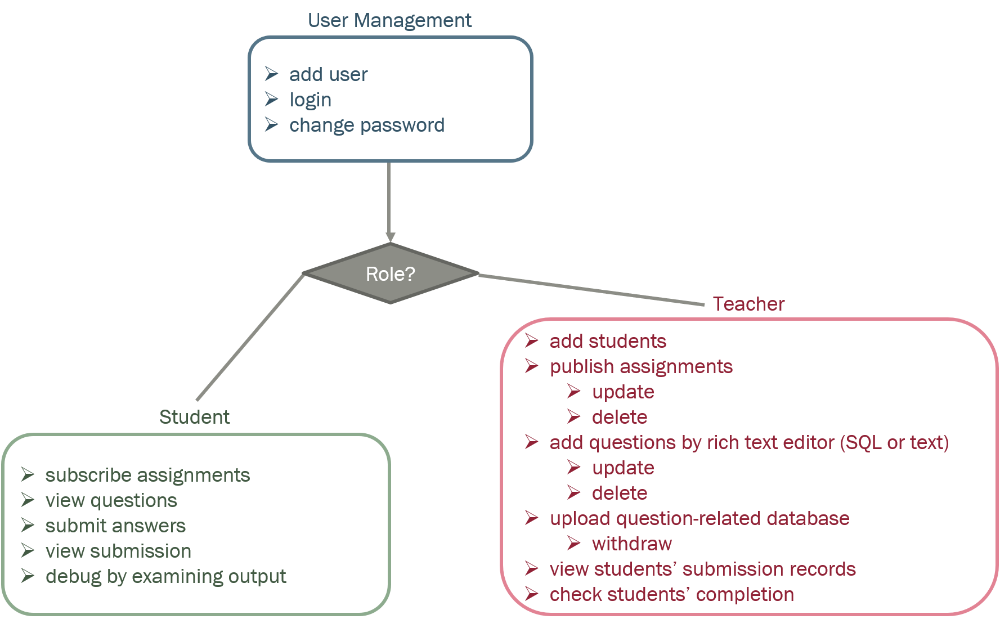
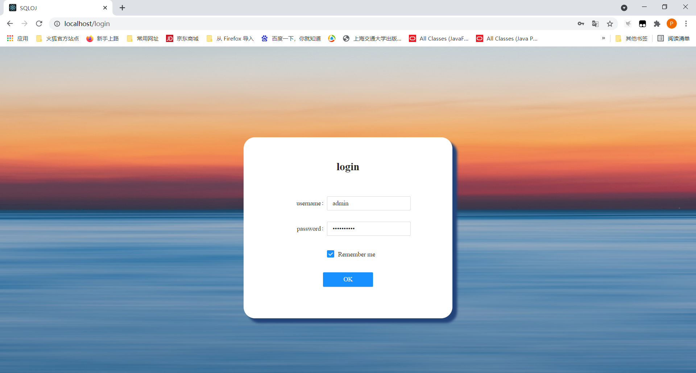
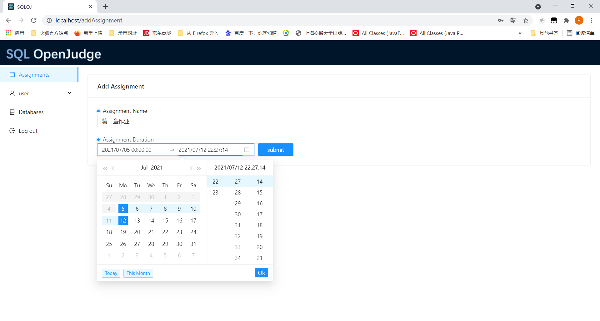
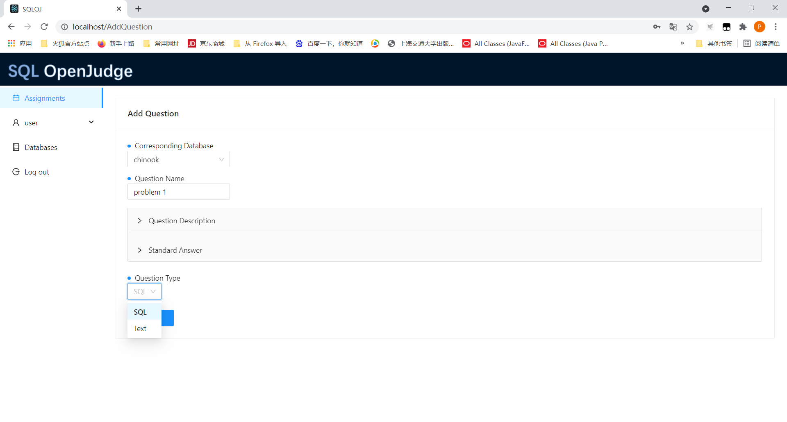
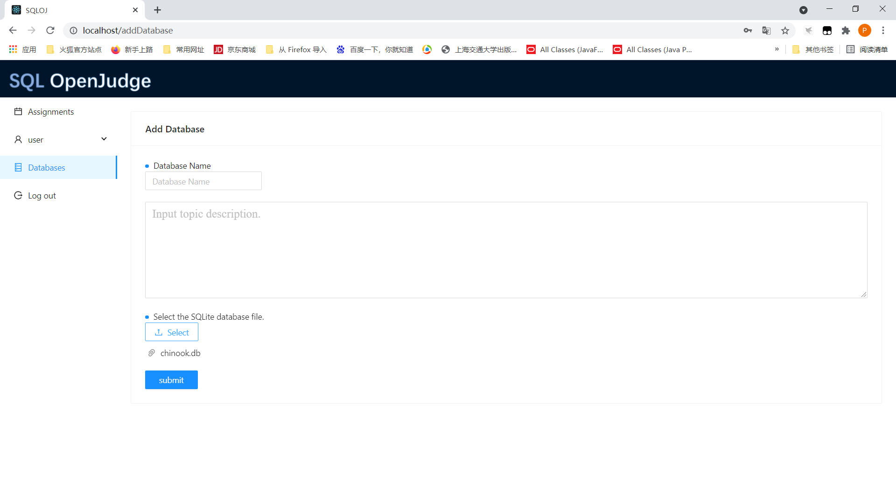
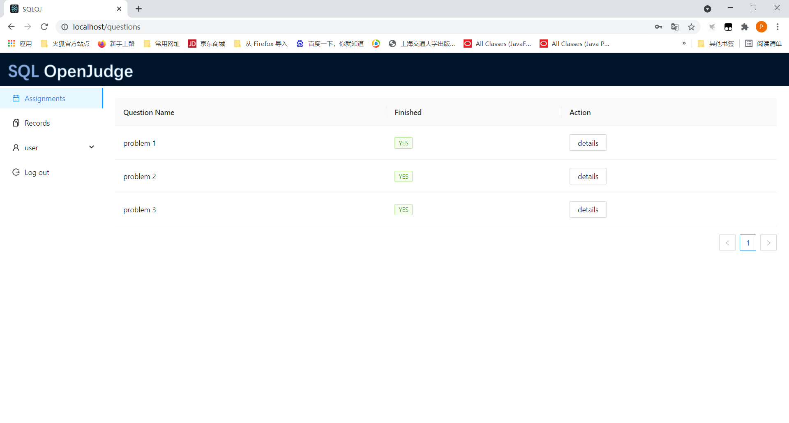
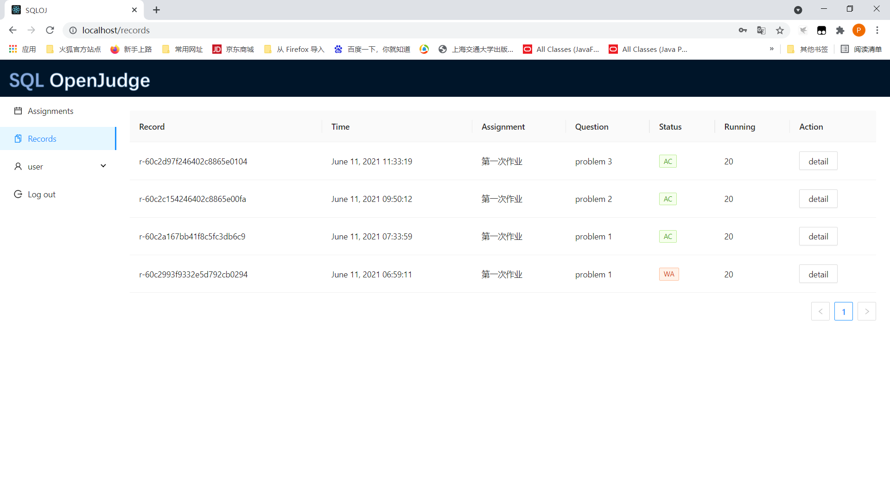
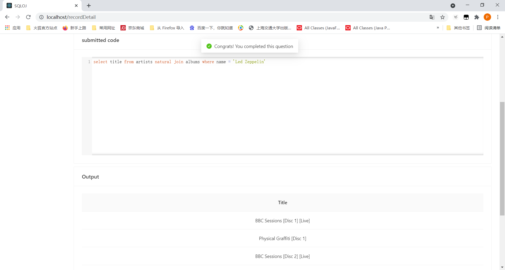
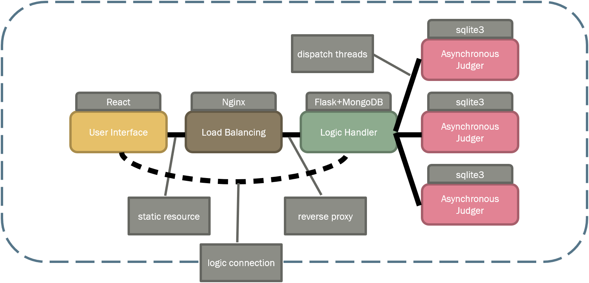

# SQLOJ

一个集成SQL语句自动评测和多种实用功能的轻量级数据库实验平台。

## Functionality

### Module Design


- 对于老师而言
	- 在平台上发布作业（实验），同时布置每次作业的题目
	- 在平台上查看同学们的完成情况，并能具体看到同学们提交的代码或同学们的作答情况
	- 上传自定义数据库，并在其上设计题目以供学生使用
- 对于学生而言
	- 随时查看日常作业的信息（包括第几次作业、DDL等）和自己的完成进度
	- 利用在线代码编辑器提交SQL语句或者利用富文本编辑器回答文本问题，做到实验平台和作业平台的统一
	- 学生提交可以看到输出结果并能获得错误信息。在此基础上扩展了数据隔离、错误类型、多语句提交等
	
### User Management

#### User Role

- teacher
  - 此类用户为老师或者助教设计，该用户角色可以管理学生账户，同时可以发布作业、添加题目、审查完成情况等。
  - 默认老师账户: admin
  - 默认老师密码: tsxt-adm1n
- student
  - 此类用户为学生设计，该类型用户为teacher用户创建，允许更改密码，该用户角色可以回答题目、在线debug等。

#### Login Panel



### Teacher Example Page

#### 添加作业



#### 在作业中添加问题



在一次作业中添加问题需要老师给出：

- 问题对应的数据库

  - 例：chinook（一个样例数据库）

- 问题名称

  - 例：problem 1

- 问题描述

  - 查询'Led Zeppelin'的所有albums的title

- 问题的答案

  - ```sqlite
    select title from artists natural join albums where name = 'Led Zeppelin'
    ```

- 问题的类型：是SQL题目还是文本问题

  - 例：SQL

#### 上传数据库



上传的数据库应为sqlite的.db格式文件。

### Student Example Page

#### 查看作业问题列表



在这里学生查看每次作业的问题列表，并检查自己的完成情况。

#### 查看自己所有提交记录



Status对应值可能为(RUNNING(正在运行)/AC/WA/RE(运行时错误)/TLE)。

#### 查看自己某一条提交记录具体信息



这里可以查看到自己提交的答案和对应的执行结果，进入到该界面会显示该记录的状态，如果提交结果错误会显示与标准答案的差异（例：错n行，少m行）。

## Deployment

我们设计了多种部署方式，最推荐的方式是使用docker进行部署。

### Run in Docker Container

#### Pull Image from Dockerhub (Recommended)

```shell
docker pull ptyin/sqloj
```

#### Build Image Using Dockerfile (Plan B)

```shell
cd app && npm install && npm run build
docker build -t sqloj ..
```

#### Run from The Image

以上述两种方式任意一种获得image之后即可构建container运行。

```shell
docker run -p 80:80 -v <mongo-db-path>:/data/db -v <mongo-configdb-path>:/data/configdb -v <sqlite-path>:/var/lib/sqloj ptyin/sqloj:latest 
```

\<mongo-db-path\>\<mongo-configdb-path\>\<sqlite-path\>请分别替换为你服务器中数据可持久化目录路径。

e.g.,

In Windows:

```shell
docker run -p 80:80 -v D:\SQLOJ\mongodb\data:/data/db -v D:\SQLOJ\mongodb\config:/data/configdb -v D:\SQLOJ\sqlite:/var/lib/sqloj --name test ptyin/sqloj:latest 
```

In Linux:

```shell
docker run -p 80:80 -v /opt/SQLOJ/mongodb/data:/data/db -v /opt/SQLOJ/mongodb/config:/data/configdb -v /opt/SQLOJ/sqlite:/var/lib/sqloj --name test ptyin/sqloj:latest 
```

### Run Using Docker Compose

该方式适用于要求快速启动和删除容器的开发者使用。

#### Start up Container

```shell
docker compose -f ./docker-compose.yml up -d
```

#### Stop Container

```shell
docker compose down
```

### Run From Source

#### Install Dependencies

- Frontend

  - node, npm

  - ```shell
    cd app && npm install
    ```

- Backend

  - python3, python3-pip, MongoDB (run on port 27017)

  - ```shell
    cd backend && pip install -r requirements.txt
    ```

#### Setup Load Balancing Server (Optional)

如果有性能需求，可以使用Nginx做负载均衡，反向代理python WSGI后端服务器（运行在5366端口）。

因为HTTP服务器和后端WSGI服务器存在跨域请求问题（同源策略/SOP是一种约定，所谓同源是指"协议+域名+端口"三者相同，即便两个不同的域名指向同一个ip地址，也非同源），需要更改nginx配置从而代理跨域。

配置文件可参考如下：

```nginx

#user  nobody;
worker_processes  1;

#error_log  logs/error.log;
#error_log  logs/error.log  notice;
#error_log  logs/error.log  info;

#pid        logs/nginx.pid;


events {
    worker_connections  1024;
}


http {
    include       mime.types;
    default_type  application/octet-stream;
	
	underscores_in_headers on;
    client_max_body_size   20m;

    log_format  main  '$remote_addr - $remote_user [$time_local] "$request" '
                      '$status $body_bytes_sent "$http_referer" '
                      '"$http_user_agent" "$http_x_forwarded_for"';

    #access_log  logs/access.log  main;

    sendfile        on;
    #tcp_nopush     on;

    #keepalive_timeout  0;
    keepalive_timeout  65;

    #gzip  on;

	upstream backend{
            server 127.0.0.1:5366;

    }

    server {
        listen       80;
        server_name  localhost;


		location /api {
			proxy_pass http://backend;
			proxy_set_header X-Real-IP __IP_HEADER__;
			proxy_set_header Host $http_host;
			client_max_body_size 200M;
			proxy_http_version 1.1;
			proxy_set_header Connection '';
		}

        location  / {
          root ../app/build;
          index  index.html ;
          try_files $uri $uri/ /index.html;
        }

        #error_page  404              /404.html;

        error_page   500 502 503 504  /50x.html;
        location = /50x.html {
            root   html;
        }
    }

}

```

#### Run

- Frontend

  - ```shell
     cd app && npm run start80
    ```

- Backend

  - ```shell
    cd backend && python wsgi.py
    ```

## Project Structure



- User Interface
  - React构建，优点在于有较高的性能，代码逻辑简单。
  - Ant Design定制界面主题，构造交互语言和视觉风格。
  - Braft Editor，富文本编辑，用以丰富问题描述。
  - 代码编辑：Code Mirror，支持SQL自动补全，SQL语法高亮，显示行号等等。
- Load Balancing
  - 将前端代码使用webpack打包为静态资源，使用Nginx做负载均衡的反向代理，占有内存少，并发能力强。
- Logic Handler
  - Flask框架，使用 Python 编写的轻量级 Web 应用框架。 WSGI 工具箱采用 Werkzeug ，模板引擎则使用 Jinja2 。Flask使用 BSD 授权。
  - MongoDB存放网站数据，其是一个介于关系数据库和非关系数据库之间的产品，它支持的数据结构非常松散，是类似json的bson格式，因此可以存储比较复杂的数据类型。
- Asynchronous Judger
  - Sqlite3存放题目相关数据库，和判题相关。
  - python threading库来派发调度异步判题器。

## Implementation

### Frontend

前端采用React开放框架，采用声明范式，可以轻松描述应用，通过对DOM的模拟，最大限度地减少与DOM的交互。同时，React可以与已知的库或框架很好地配合。UI设计细节方面主要采用了蚂蚁设计（蚂蚁集团的设计架构）封装的 Ant Design 组件库，通过模块化解决方案，降低冗余的生产成本。

前后端交互采用axios，是一个基于Promise的HTTP客户端，同时，axios具有拦截器的功能，比如当用户角色为学生但是申请的是老师的api，后端返回状态码401，拦截器可以拦截该响应并正确进行处理。

前端使用sessionStorage进行临时存储数据，从而减少了前后端交互、节省了资源开销，同时使得前端更容易的进行路由。如果用户在登陆界面点击remember me，将使用localStorage进行用户名和密码的本地存储，从而下次打开网站时不需要再输入账户密码。

### Backend

后端采用Flask+MongoDB，Flask是一个使用 Python 编写的轻量级 Web 应用框架。其 WSGI 工具箱采用 Werkzeug ，模板引擎则使用 Jinja2 。Flask使用 BSD 授权。MongoDB可以存储比较复杂的数据类型，其最大的特点是它支持的查询语言非常强大，其语法有点类似于面向对象的查询语言，几乎可以实现类似关系数据库单表查询的绝大部分功能，而且还支持对数据建立索引。

对于用户的管理，后端加密存储用户密码，在用户登录时将用户凭据附加在用户客户端的Cookie中，之后请求api根据Cookie中的凭据来正确处理请求的权限问题。

此外，后端使用Flask简化设计了[RESTful API](RESTful API.pdf)。使用源码构建，可以浏览器访问http://127.0.0.1:5366/api来进行查看。而前端负责设计了前期的一些[API](API.md)，功能文档可以在[functions.md](functions.md)查看。

### Judge

这一部分将介绍如何对核心部分SQL判题的设计思想和实现。

#### 题目答案

老师上传题目时上传正确SQL语句，后端在收到添加题目请求后，得到对应SQL语句的输出进行存储。

#### 隔离

对学生提交的SQL语句直接在对应的SQLite数据库中进行自动化测试，可能会导致恶意代码带来的系统和安全风险，也可能会导致简单的错误或低效的代码。 数据库系统是一门复杂的高级课程，而SQL语句的运用也千变万化，我们无法枚举出所有用户提交的可能性来规避风险而只能使用沙箱或隔离机制来限制执行。对此我们使用了两层次的隔离机制。

##### DBS级隔离

我们采用两种DBS (MongoDB, SQLite)对我们的网站数据进行分割，对老师提交的数据库和判题部分我们操作SQLite，而对于其它的网站数据我们使用MongoDB进行保存。这有效的规避了由用户提交的SQL语句利用SQL注入漏洞从而获得网站数据的风险。

##### SQL运行时隔离

仅保证DBS隔离是一种粗粒度的隔离手段，为了保证判题过程并发性和原始问题数据库的一致性，对于学生提交代码我们采用基于深拷贝的运行隔离，即将原始数据库进行拷贝从而在临时副本中允许提交代码，并和老师上传题目时获得的标准答案进行比较来获得最终判题状态。

#### 基于Transaction的运行

对于用户提交的代码，我们允许其一次性提交多条语句，我们将SQL语句进行分割，将其视为一组Transaction进行允许，保证了事务的ACID特性。
